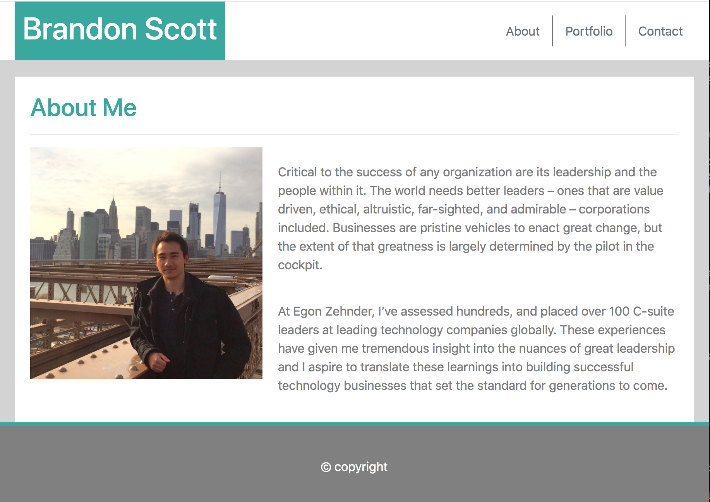

## Description
Created the baseline of a personal website that will showcase a breif on my background, a portfolio of projects, as well as a way to contact me. Built with responsive design for multiple screen sizes using Bootstrap's framework and Media Queries.

Currently includes three HTML files all linked via a navbar. Files are uilt with semantic HTML and appropriate comments. In the Assets folder are visual templates which these files were built off of as well as any aditional photo's used on the page and CSS files.

Technologies include: HTML, CSS, and Bootstrap's Framework.

## Links
Github Repo: https://github.com/Bscott95/homework2
Link to site: https://bscott95.github.io/homework2/
Link to my other personal website: http://brandonscott.info/ 

## Screenshot

